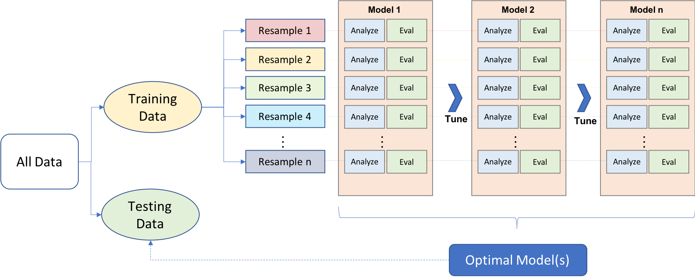

<style>
@import url('https://fonts.googleapis.com/css?family=Lato&display=swap');
</style>

<link rel="stylesheet" href="//fonts.googleapis.com/css?family=Lato" />

`)

```{r rmarkdown-setup, echo = FALSE}
knitr::opts_chunk$set(warning = FALSE)
knitr::opts_chunk$set(message = FALSE)
options(scipen = 999)

```

# Day 3: Resampling Methods

**Aaron R. Williams - Data Scientist (IBP)**

```{r setup}
library(tidyverse)
library(gridExtra)

```

## Review

**Generalizability:** How well a model makes predictions on unseen data relative to how well it makes predictions on the data used to estimate the model. 

**In-sample error:** The predictive error of a model measured on the data used to estimate the predictive model. 

**Out-of-sample error:** The predictive error of a model measured on the data **not** used to estimate the predictive model. Out-of-sample error is generally greater than the in-sample error.

**Training set:** A subset of data used to develop a predictive model. The share of data committed to a training set depends on the number of observations, the number of predictors in a model, and heterogeneity in the data. 0.8 is a common share. 

**Testing set:** A subset of data used to estimate model performance. The testing set usually includes all observations not included in the testing set. *Do not look at these data until the very end and only estimate the out-of-sample error rate on the testing set once.* If the error rate is estimated more than once on the testing data, it will underestimate the error rate.

**Data leakage:** When information that won't be available when the model makes out-of-sample predictions is used when estimating a model. Looking at data from the testing set creates data leakage. Data leakage leads to an underestimate of out-of-sample error. 

$$RMSE = \sqrt{\frac{1}{n} \sum_{i = 1}^n (Y_i - \hat{Y_i})^2}$$

## Creating Useful Models

1. Create many candidate models
2. Pick the "best" model from the candidate models

"Best" can be defined by the lowest error estimate. Sometimes the "best" model doesn't have the lowest error estimate but is parsimonious, computationally feasible, avoids issues with bias, or accounts for the costs of different types of errors. 

## Creating Many Models

Supervised machine learning is mostly concerned with the process of creating many candidate models and then picking the "best" model from among the candidate models. There are at least three ways to generate candidate models. 

### 1. Feature Engineering

**Feature engineering:** The addition, deletion, and transformation of variables before applying algorithms to the data. 

Feature engineering is often the most labor intensive part of the predictive modeling process. Many of the potential steps are similar in concept to preprocessing for estimating a model for statistical inference. However, feature engineering needs be repeated for each resampling iteration. 

When preprocessing, Boehmke and Greenwell recommended the following order of preprocessing steps: 

1. Filter out predictors with low or no variance
2. Impute missing values
3. Normalize data to resolve skewness
4. Standardize numeric features
5. Dimension reduction
6. Lumping, one-hot encoding, and dummy encoding

### 2. Picking algorithms

There are many different algorithms than can be used to create predictive models for any given application. Linear regression and logistic regression are two common methods in policy analysis. There are many other algorithms like $K$-Nearest Neighbors (KNN) and Classification and Regression Trees (CART). 

### 3. Hyperparameter Tuning

**Hyperparameter:** Model parameters that are specified before estimating the model. 

Linear regression and logistic regression don't have any hyperparameters. $K$-Nearest Neighbors has one parameter, $K$, the number of nearest observations to be considered for prediction. The best way to determine the optimal value of $K$ is to try many values of $K$ in a process called hyperparameter tuning. The simplest method for hyperparameter tuning is grid search. 

**Grid search:** A process of trying unique combinations of hyperparameters by specifying a Cartesian grid of the hyperparameters and estimated a model for each row of the grid (with resampling).

For example, build a grid with values of $K$ ranging from 1 to 15 by increments of 2. Estimate a KNN model with resampling for each $K$. Compare the resulting error metrics and determine the optimal hyperparameter.

## Bias-Variance Trade-off

Using specialized algorithms (implication 1) and optimizing for an error metric (implication 2) creates a problem. Many algorithms can memorize the training data. This results in overfit models that don't generalize well. 

```{r, out.width = "75%", echo = FALSE}
knitr::include_graphics(here::here("lessons", "images", "Overfitting_web.png"))

```

**Source:** [Chris Albon](https://machinelearningflashcards.com/)

Not all error is created the same. Prediction error can be decomposed into three types of error: irreducible error, bias error, and variance error. Understanding the types of error will inform modeling decisions. 

$$MSE = \frac{1}{n}\sum_{i = 1}^n (y_i - \hat{y}_i)^2$$

Assuming $y_i$ independent and $y_i - \hat{y}_i \sim N(0, \sigma^2)$, then

$$E[MSE] = \sigma^2 + (\text{model bias})^2 + \text{model variance}$$

~ Page 97 in Applied Predictive Modeling by Kuhn and Johnson

**Irreducible error ($\sigma^2$):** Error that can't be reduced regardless of model quality. This is often caused by factors that affect the outcome of interest that aren't measured or included in the data set.

**Bias error:** Expected value of the difference between prediction of a predictive model and the correct value. This is how well a model fits the underlying structure of the data.

Here, the model on the left does a poor job fitting the data (high bias) and the model on the right does a good job fitting the data (low bias).  

<br>

```{r echo = FALSE, fig.height = 2.5, fig.width = 4, fig.align = "center", message = FALSE, warning = FALSE}
set.seed(20200225)

sample1 <- tibble(
  x = runif(100, min = -10, max = 10),
  noise = rnorm(100, mean = 10, sd = 10),
  y = -(x ^ 2) + noise
)

grid.arrange(
  sample1 %>%
    ggplot(aes(x, y)) +
    geom_point(alpha = 0.5) +
    geom_smooth(method = "lm",
                se = FALSE) +
    theme_void() +
    labs(title = "High Bias") +
    theme(plot.margin = unit(c(1, 1, 1, 1), "cm")),
  
  sample1 %>%
    ggplot(aes(x, y)) +
    geom_point(alpha = 0.5) +
    geom_smooth(se = FALSE,
                span = 0.08) +
    theme_void() +
    labs(title = "Low Bias") +
    theme(plot.margin = unit(c(1, 1, 1, 1), "cm")),
  ncol = 2
)
```

<br>

**Variance error:** Variability of a model prediction given for a given data point. This is how much a model prediction will change if different training data are used.

Here, the model on the left does not change much as the training data change (low variance) and the model on the right changes a lot when the training data change (high variance). 

<br>

```{r echo = FALSE, fig.height = 4, message = FALSE, warning = FALSE}
set.seed(20200226)

sample2 <- tibble(
  sample_number = rep(c("Sample 1", "Sample 2", "Sample 3", "Sample 4"), 100),
  x = runif(400, min = -10, max = 10),
  noise = rnorm(400, mean = 10, sd = 10),
  y = -(x ^ 2) + noise
)

grid.arrange(
  sample2 %>%
    ggplot(aes(x, y)) +
    geom_point(alpha = 0.5) +
    geom_smooth(method = "lm",
                se = FALSE,
                alpha = 0.5) +
    facet_wrap(~sample_number) +
    theme_void() +
    labs(title = "Low Variance") +
    theme(plot.margin = unit(c(1, 1, 1, 1), "cm")),
  
  sample2 %>%
    ggplot(aes(x, y)) +
    geom_point(alpha = 0.5) +
    geom_smooth(se = FALSE,
                span = 0.08,
                alpha = 0.5) +
    facet_wrap(~sample_number) +
    theme_void() +
    labs(title = "High Variance") +
    theme(plot.margin = unit(c(1, 1, 1, 1), "cm")),
  ncol = 2
)
```

<br>

As can be seen in the error decomposition and plots above, for any given amount of total prediction error, there is a trade-off between bias error and variance error. When one type of error is reduced, the other type of error increases.

The bias-variance trade-off can generally be reconceived as a simplicity-complexity trade-off. Simple models often have high bias and low variance. A linear regression with a few predictor variables, a pretty simple model, may do a mediocre job capturing the underlying relationship in the data but it will be stable across resamples and between the training and testing data. Meanwhile, polynomial regression or regression splines, complex models, may do a great job capturing the underlying relationship in any given sample but the estimated model could change a lot between resamples and the training and testing data. 

```{r echo = FALSE, fig.height = 2.5, fig.width = 4, fig.align = "center"}
tribble(
  ~x, ~bias_squared, ~variance,
  0, 10, 3,
  1, 7, 3.02,
  2, 5, 3.05,
  3, 4, 3.1,
  4, 3.5, 3.15,
  5, 3.25, 3.25,
  6, 3.15, 3.5,
  7, 3.1, 4,
  8, 3.05, 5, 
  9, 3.02, 7, 
  10, 3, 10
  ) %>%
  mutate(total_error = bias_squared + variance) %>%
  gather(-x, key = "key", value = "value") %>%
  ggplot(aes(x, value, color = key)) +
  geom_point() +
  geom_line() +
  scale_x_continuous(labels = NULL) +
  scale_y_continuous(limits = c(0, NA),
                     labels = NULL) +
  labs(x = "Complexity or Overfitting",
       y = "Error") +
  theme_minimal()
```

Similarly, the bias-variance trade-off can be reconceived as an underfitting-overfitting trade-off. KNN with large $k$ tends to be underfit with KNN with small $k$ tends to be overfit.

```{r, out.width = "75%", echo = FALSE}
knitr::include_graphics(here::here("lessons", "images", "Overfit_Vs_underfit_web.png"))

```

**Source:** [Chris Albon](https://machinelearningflashcards.com/)

Overall, the objective is to minimize the total error. In the beginning, this often means building up a model to reduce the bias/simplicity/underfitting of the model. Later, it means reducing a model to reduce variance/complexity/overfitting.

## Picking from Many Models

Now we'll cover the process of picking the best model from candidate models. 

With one model, the training data is used to estimate the model and the testing data is used to estimate the out-of-sample error rate. *The testing data should only be used at the end of the modeling process to estimate the true out-of-sample error rate.* Using the testing data more than once will result in overfitting and an underestimate of the training error because the decisions used to create a model on the training data are at least partially optimized to the unique features of the training data. 

So how do we estimate and compare out-of-sample error rates if we can only use the testing data once? Given unlimited data, we could just keep splitting the data into more and more testing sets to estimate the out-of-sample error. That is often impractical. Instead, model performance is generally compared with resampling methods. 

**Resampling methods** iteratively split the training data into subgroups, estimate the model on one portion of the data, and measure the error rate on the other portion of the data. This process happens many times and the error rate metric is then averaged. For example, if resampling happens j times, then then $\hat{RMSE}$ is the mean of the ten $RMSE_j$

$$\hat{RMSE} = \sum_{j = 1}^{n_j} \frac{1}{n_j} \sqrt{\frac{1}{n_i} \sum_{i = 1}^{n_i} (Y_i - \hat{Y_i})^2}$$

Three popular resampling methods are v-fold cross-validation (also called k-fold cross-validation), leave-one-out cross-validation (a special case of v-fold cross-validation), and bootstrapping. We will focus on v-fold cross-validation.

**Analysis data:** Training data within a resample (Max Kuhn)

**Assessment data:** Testing data within a resample (Max Kuhn)

**v-fold cross-validation:** Break the data into $v$ equal-sized, exclusive groups. Train the model on data from $v - 1$ folds (analysis data) and measure the error metric (i.e. RMSE) on the left-out fold (assessment data). Repeat this process $v$ times, each time leaving out a different fold. Average the $v$ error metrics. 

<br>

```{r, echo = FALSE}
knitr::include_graphics("images/cv.png")
```

**Source:** [Hands-on Machine Learning with R](https://bradleyboehmke.github.io/HOML/process.html#resampling)

<br>

* $v$-fold cross-validation is usually applied to the training data.
* $v$ is contextual but 10 is standard. [Max Kuhn's blog](http://appliedpredictivemodeling.com/blog/2014/11/27/vpuig01pqbklmi72b8lcl3ij5hj2qm) has some convincing simulations that demonstrate the performance of different $v$.

**Note:** Sample-specific preprocessing needs to be re-estimated within each resample. For example, when mean centering, means need to be recalculated for each resample instead of for the overall training data.

```{r, echo = FALSE}
knitr::include_graphics("images/minimize-leakage.png")
```

**Source:** [Hands-on Machine Learning with R](https://bradleyboehmke.github.io/HOML/process.html#resampling)

## Putting it All Together

<br>

1. Split the data into a training set and a testing set. 
2. Pick a resampling method. 
3. Consider many potential models and estimate the out-of-sample error rate based on a resampling method like v-fold cross-validation.
    1. Preprocess and feature engineer the analysis data (training data within a resample). Repeat the process from scratch for each resample.
    2. Use different algorithms
    3. For each algorithm, tune hyperparameters with a method like grid search
4. Pick a final model. Train the final model on all training data without resampling. 
5. Estimate the out-of-sample error rate by predicting values in the testing data set.
6. If the model is "good", then implement the model and make predictions.
7. Regularly evaluate implemented models to see how well the model generalizes. 

<br>

```{r, echo = FALSE}

```

**Source:** [Hands-on Machine Learning with R](https://bradleyboehmke.github.io/HOML/process.html#resampling)

